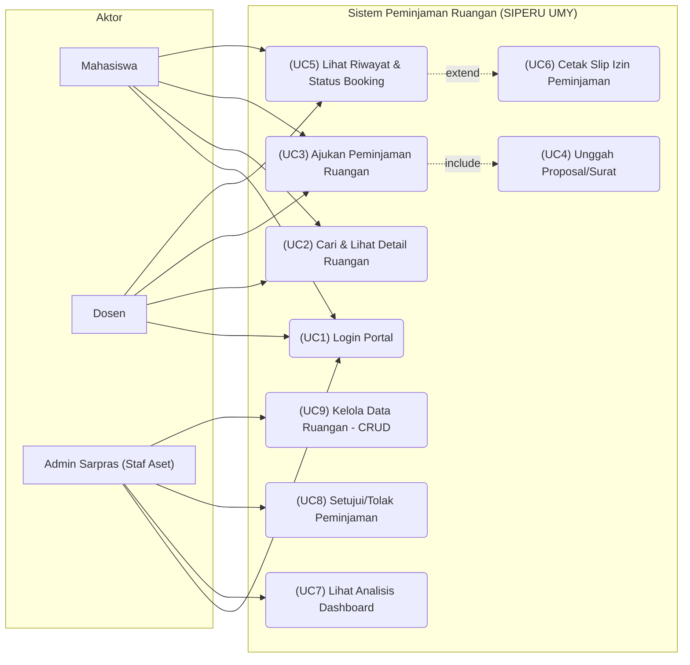
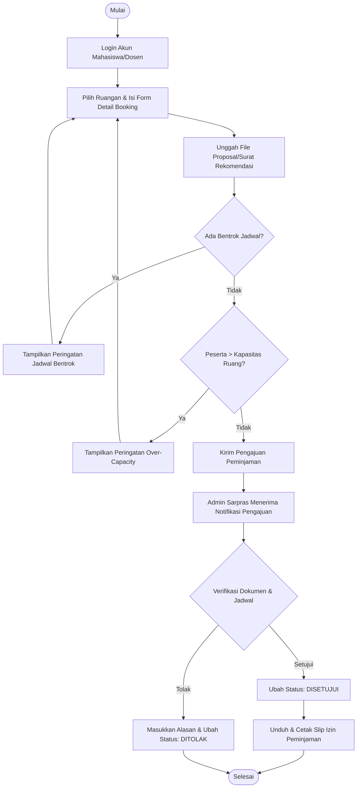
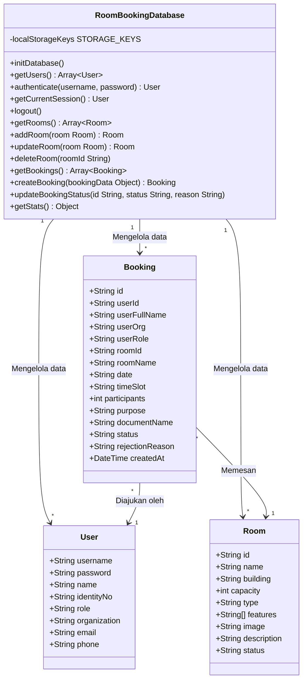
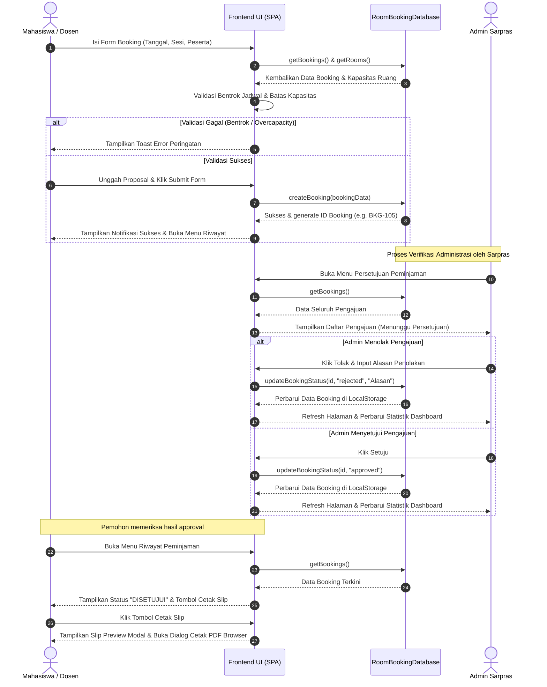
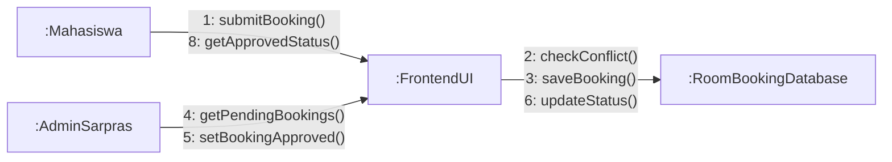

# Dokumentasi Analisis Sistem & Diagram UML: SIPERU UMY

Dokumen ini berisi analisis kebutuhan sistem beserta spesifikasi diagram UML dalam format **Mermaid.js** untuk **SIPERU UMY (Sistem Peminjaman Ruangan Kampus UMY)**.

---

## 1. Analisis Kebutuhan Sistem (System Requirements Analysis)

### A. Kebutuhan Fungsional (Functional Requirements)
1. **Portal Login & Autentikasi**: Pengguna (Mahasiswa, Dosen, Admin Sarpras) dapat melakukan login secara aman untuk mengakses menu dashboard sesuai dengan role masing-masing.
2. **Lihat Ketersediaan Ruangan**: Pemohon dapat mencari, memfilter, dan melihat detail spesifikasi ruangan (kapasitas, fasilitas, lokasi gedung) secara realtime.
3. **Pengajuan Peminjaman (Booking)**: Pemohon dapat mengajukan permohonan sewa ruangan dengan menentukan tanggal, sesi waktu, jumlah peserta, tujuan kegiatan, serta mengunggah mock berkas proposal dalam format PDF.
4. **Validasi Bentrok Jadwal**: Sistem secara otomatis memblokir pengajuan baru jika ruangan, tanggal, dan sesi waktu yang diminta telah disewa atau sedang dalam status pending/approved oleh pemohon lain.
5. **Validasi Kapasitas Ruang**: Sistem memastikan jumlah estimasi peserta yang diinput tidak melebihi kapasitas maksimal daya tampung ruangan.
6. **Dashboard & Visualisasi Staf**: Staf Sarpras (Admin) dapat melihat visualisasi kepadatan peminjaman per gedung dan diagram status peminjaman menggunakan Chart.js.
7. **Persetujuan & Penolakan**: Admin Sarpras dapat mengubah status peminjaman menjadi disetujui (Approved) atau ditolak (Rejected) dengan menyertakan alasan penolakan tertulis.
8. **Cetak Slip Izin**: Pemohon dapat mencetak slip digital resmi yang dilengkapi barcode QR Code sebagai bukti verifikasi sah di lapangan.

### B. Kebutuhan Non-Fungsional (Non-functional Requirements)
1. **Local State Persistence**: Menggunakan `localStorage` browser untuk menyimpan data users, rooms, dan bookings secara lokal tanpa database eksternal.
2. **Kecepatan SPA**: Navigasi perpindahan menu cepat tanpa memicu reload halaman secara penuh (Single Page Application).
3. **Antarmuka Responsive**: Desain premium berbasis mobile-first yang rapi saat diakses melalui smartphone maupun PC.
4. **Printability**: Slip digital dioptimalkan khusus menggunakan CSS `@media print` agar rapi saat dicetak ke format kertas fisik atau disimpan sebagai PDF.

---

## 2. Use Case Diagram

---

## 3. Activity Diagram

---

## 4. Class Diagram

---

## 5. Sequence Diagram

---

## 6. Communication Diagram

